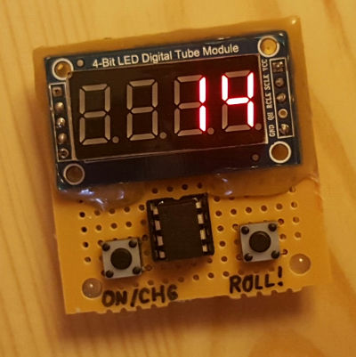
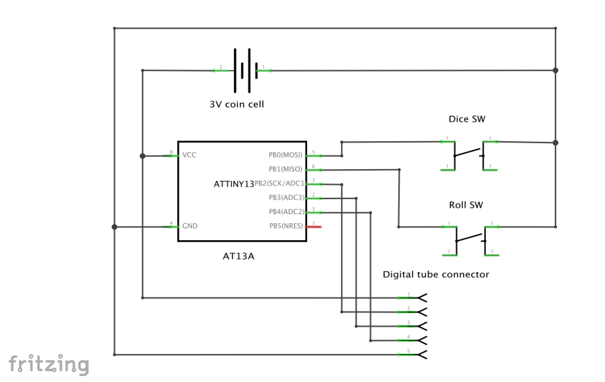

# Attiny13A Digital dice

Digital dice toy implementation in AVR C  
Uses one Attiny13A and TM74HC595 4 digit "digital tube" display  
Supports d4, d6, d8, d10, d20 and 2 d6 dices  

## Interface

#### ON/CHG button

Press this button to switch the toy on. While on press this button to change dice.

#### ROLL button

Press and hold this button to roll the selected dice. Upon release a number will appear.   
Press and hold ON/CHG, ROLL button together to initialize random seed.  
The toy automatically turns itself off after a period of idling.  

## Schematics

## Copyright

This is the work of Adam Kovesdi (c) 2016 all rights reserved.

